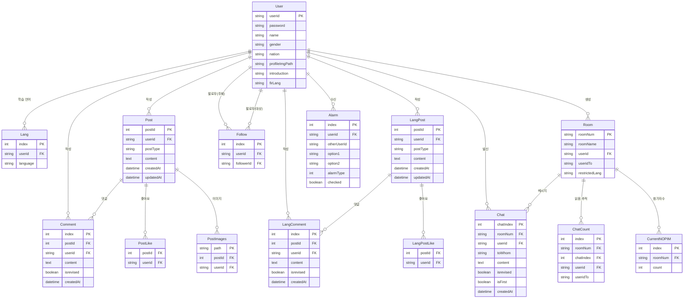
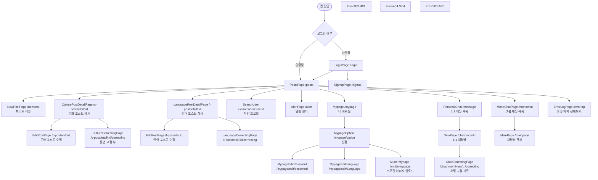
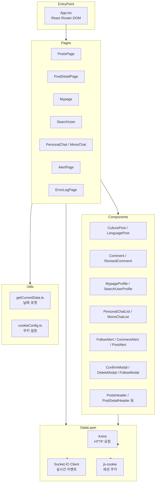

# NaiClover — 포트폴리오 문서

> **Notion 참고 링크** (`https://shore-alley-14b.notion.site/Flow-Timer-32141843d2ce8027beded4a528a44d41`) — 접근 불가 확인됨.
> 이 문서는 전적으로 코드베이스 분석 기반으로 작성되었습니다.

---

## 목차

1. [프로젝트 개요](#1-프로젝트-개요)
2. [기획 의도 및 HelloTalk 비교 분석](#2-기획-의도-및-hellotalk-비교-분석)
3. [사용 기술](#3-사용-기술)
4. [DB 구조도 (추정 ERD)](#4-db-구조도-추정-erd)
5. [화면 흐름도](#5-화면-흐름도)
6. [폴더 구조](#6-폴더-구조)
7. [프론트엔드 아키텍처](#7-프론트엔드-아키텍처)
8. [주요 기능 및 상세 기능](#8-주요-기능-및-상세-기능)
9. [기능별 상세 설명](#9-기능별-상세-설명)
10. [트러블슈팅](#10-트러블슈팅)
11. [포트폴리오용 요약](#11-포트폴리오용-요약)

---

## 1. 프로젝트 개요

| 항목 | 내용 |
|------|------|
| **프로젝트명** | NaiClover v1.2 |
| **한 줄 소개** | 언어 학습자와 외국어 원어민을 연결하는 언어 교환 소셜 플랫폼 |
| **대상 사용자** | 외국어를 학습 중이거나, 자국어를 가르쳐주고 배움을 받고 싶은 언어 교환 파트너를 찾는 사용자 |
| **해결하려는 문제** | 단순 어학 앱의 한계를 넘어, 피드·채팅·문법 교정·팔로우를 통해 실제 원어민과 지속적으로 교류하며 학습할 수 있는 환경 제공 |
| **개발 기간** | 2025년 1월 15일 ~ 2월 6일 (3주, 팀 프로젝트) |
| **현재 상태** | 팀 프로젝트 완료 후 개인이 단독으로 UI/UX 리팩토링 및 기능 개선 진행 중 |
| **배포** | AWS EC2 + PM2 + NGINX (`http://3.34.47.72/`) |
| **팀 구성** | 다인 팀 프로젝트 (GitHub PR 이력 기준 복수 기여자 확인됨) |
| **본인 담당 영역** | 프론트엔드 전반 — 마이페이지, SearchUser 페이지, 채팅 프론트, 푸터, 오토스크롤 로직, 포스트 작성/삭제/검색, ErrorLog 페이지 |

**서비스 성격:** 포스트(피드) 기반 커뮤니티 + 실시간 1:1 및 그룹 채팅 + 언어 교정 로그 기록 기능을 통합한 풀스택 언어 교환 플랫폼.

> **면접에서 이렇게 설명 가능**
> "HelloTalk을 모티브로 기획한 언어 교환 플랫폼으로, 3주간 팀 개발 후 제가 단독으로 UI/UX 리팩토링과 기능 추가를 이어가고 있는 프로젝트입니다."

---

## 2. 기획 의도 및 HelloTalk 비교 분석

### 2-1. 왜 이 서비스를 만들었는가

기존 HelloTalk 같은 서비스는 기능이 방대해 언어 학습 핵심 흐름(피드 작성 → 교정 → 채팅)이 여러 메뉴에 분산되어 있습니다. NaiClover는 이 흐름을 단순화해 "포스트 작성 → 댓글 교정 → 채팅"의 연결 고리를 하나의 서비스 안에서 완결되도록 설계했습니다.

또한 HelloTalk는 글로벌 대상 서비스이므로 한국 사용자 입장에서 UI 진입 장벽이 있는 반면, NaiClover는 한국어 UI와 국내 UX 관습에 맞는 레이아웃을 채택하고 있습니다. (코드상 확인됨: 날짜 포맷 한국어 처리, 국기 기반 언어 표시)

### 2-2. HelloTalk와의 비교

| 기능 관점 | HelloTalk | NaiClover | 라벨 |
|-----------|-----------|-----------|------|
| 피드(포스트) 기반 언어 교환 | O | O — 문화/언어 두 카테고리 분리 | 코드상 확인됨 |
| 댓글 문법 교정 기능 | O | O — 교정 기록을 `ErrorLog` 페이지로 별도 보관 | 코드상 확인됨 |
| 1:1 채팅 | O | O — Socket.IO 기반 실시간 | 코드상 확인됨 |
| 그룹 채팅 | O | O — "MonoChat": 방 언어 제한 기능 포함 | 코드상 확인됨 |
| 팔로우/팔로워 | O | O — 팔로우 기반 알림 시스템 연동 | 코드상 확인됨 |
| 채팅 메시지 교정 | O | O — 채팅 교정 내역 별도 페이지(`ChatCorrectingPage`) | 코드상 확인됨 |
| 학습 언어 그룹 채팅 | 제한적 | O — 방 언어 강제 설정(Korean/English/Japanese/Chinese/French/German) | 코드상 확인됨 |
| 광고/추천 알고리즘 | O (복잡) | 없음 — 팔로우 기반 단순 피드 | 정황상 추정 가능 |
| SNS 과잉 기능 (스토리, 스티커 등) | O | 없음 — 핵심 기능 중심 | 정황상 추정 가능 |
| 국내 사용자 친화 UI | 낮음 | 한국어 기본, 국기 아이콘 기반 언어 표시 | 코드상 확인됨 |
| 글로벌 다국어 지원 | O | 추가 확인 필요 | 추가 확인 필요 |

### 2-3. 차별화 해석 요약

- **기능 흐름 단순화:** 포스트 → 교정 → ErrorLog의 3단 흐름이 명확하게 연결되어 있음
- **학습 목적 중심 채팅:** MonoChat의 언어 강제 설정은 HelloTalk에 없는 기능으로, 해당 언어만 쓰도록 강제하는 몰입 학습 환경 제공 (코드상 확인됨: `restrictedLang` 필드, `Room` 모델)
- **교정 이력 아카이빙:** 교정된 댓글/채팅을 별도 로그 페이지(`/errorlog`)로 보관 — 학습 복습 관점에서 차별점

> **면접에서 이렇게 설명 가능**
> "HelloTalk을 참고했지만, 그룹 채팅에 언어 강제 설정을 붙이고 교정 기록을 별도 페이지로 아카이빙하는 방식으로 학습 목적에 특화했습니다."

---

## 3. 사용 기술

### 3-1. 프론트엔드

| 기술 | 버전 | 용도 및 선택 이유 |
|------|------|-------------------|
| React | 18.2.0 | UI 컴포넌트 기반 SPA. 대형 커뮤니티와 생태계 |
| TypeScript | 4.9.5 | 컴파일 단계 타입 안전성. 팀 협업 시 인터페이스 공유 용이 |
| React Router DOM | 6.21.3 | SPA 클라이언트 라우팅. v6 중첩 라우트 활용 |
| SCSS | — | BEM 없이도 컴포넌트별 스코프 스타일 관리. 변수/믹스인 활용 |
| Bootstrap | 5.3.2 | Grid 시스템 및 기본 컴포넌트 빠른 활용 |
| Axios | 1.6.5 | HTTP 클라이언트. 인터셉터 및 baseURL 설정 용이 |
| Socket.IO Client | 4.7.4 | 실시간 양방향 채팅. 서버와 동일 라이브러리 사용으로 호환성 확보 |
| React Hook Form | 7.49.3 | 폼 상태 관리 최적화. 비제어 컴포넌트 기반으로 리렌더링 최소화 |
| js-cookie | 3.0.5 | 세션 쿠키 읽기/쓰기 |
| React Dropzone | 14.2.3 | 이미지 업로드 드래그앤드롭 UX |
| Swiper | 11.0.5 | 게시글 이미지 캐러셀 |
| UUID | 9.0.1 | 채팅방 고유 ID 생성 |

### 3-2. 백엔드 (참고용)

| 기술 | 버전 | 용도 |
|------|------|------|
| Express.js | 4.18.2 | REST API 서버 |
| TypeScript | 5.3.3 | 서버 사이드 타입 안전성 |
| MySQL2 | 3.7.0 | RDB 드라이버 |
| Sequelize | 6.35.2 | ORM — 모델 기반 DB 접근, 마이그레이션 없이 `sync` 활용 |
| Socket.IO | 4.7.4 | 실시간 채팅 이벤트 서버 |
| Multer | 1.4.5 | 파일 업로드 미들웨어 (20MB 제한) |
| Bcrypt | 5.1.1 | 비밀번호 해싱 (salt rounds: 12) |
| Express Session + express-mysql-session | — | 세션 기반 인증, MySQL 세션 스토어 |

### 3-3. 배포/인프라

| 기술 | 용도 |
|------|------|
| AWS EC2 | 서버 호스팅 |
| PM2 | Node.js 프로세스 관리 및 자동 재시작 |
| NGINX | 리버스 프록시 (80포트 → 4000포트) |

> **면접에서 이렇게 설명 가능**
> "React + TypeScript + SCSS를 프론트에, Express + Sequelize + MySQL을 백엔드에 사용했고, 실시간 채팅은 Socket.IO로 구현했습니다. 배포는 AWS EC2에 NGINX + PM2 조합입니다."

---

## 4. DB 구조도 (추정 ERD)

> **[추정 ERD]** — 서버 Sequelize 모델(`/server/model/`) 분석 기반.
> 실제 DDL과 일부 차이가 있을 수 있습니다.



### 주요 관계 요약

| 관계 | 설명 |
|------|------|
| User ↔ User (Follow) | N:M 자기참조 관계. `userid` = 팔로우 받는 사람, `followerId` = 팔로우 하는 사람 |
| Post / LangPost | 문화 게시글 / 언어 게시글 별도 테이블로 분리 |
| Comment의 `isrevised` | 교정 여부 플래그 — ErrorLog 필터링 기준 |
| Chat의 `isFirst` | 대화 시작 메시지 구분용 플래그 |
| Room의 `restrictedLang` | MonoChat 언어 강제 설정 필드 |
| Alarm의 `alarmType` | 1=팔로우, 2=포스트댓글, 3=포스트좋아요, 4=댓글교정, 5=모노챗메시지 |

> **면접에서 이렇게 설명 가능**
> "Post와 LangPost를 분리한 이유는 두 카테고리의 비즈니스 로직이 독립적으로 확장될 가능성을 고려했기 때문입니다. 현재는 중복이지만, 향후 언어 포스트에 특화된 기능 추가 시 유리합니다."

---

## 5. 화면 흐름도



### 화면별 역할 요약

| 경로 | 화면명 | 역할 |
|------|--------|------|
| `/` | LoginPage | 인증 진입점, 로그인 상태면 `/posts`로 리다이렉트 |
| `/signup` | SignupPage | 회원가입 (ID 중복 확인, 학습 언어 선택) |
| `/posts` | PostsPage | 메인 피드. 문화/언어 탭 토글, 검색, 좋아요 |
| `/newpost` | NewPostPage | 게시글 작성 (이미지 업로드 포함) |
| `/c-postdetail/:id` | CulturePostDetailPage | 문화 포스트 상세 + 댓글 교정 |
| `/l-postdetail/:id` | LanguagePostDetailPage | 언어 포스트 상세 + 댓글 교정 |
| `/mypage` | Mypage | 내 프로필, 내 포스트, 팔로우/팔로워 확인 |
| `/searchuser/:userid` | SearchUser | 타인 프로필 조회, 팔로우 버튼 |
| `/message` | PersonalChat | 1:1 채팅방 목록 |
| `/chat/:roomId` | NewPage | 실시간 1:1 채팅방 |
| `/monochat` | MonoChatPage | 그룹 채팅방 목록 + 언어 필터 |
| `/mainpage` | MainPage | 채팅방 생성/참가 관리 허브 |
| `/alert` | AlertPage | 알림 목록 + 알림 삭제 |
| `/errorlog` | ErrorLogPage | 교정 이력 전체 조회 |

> **면접에서 이렇게 설명 가능**
> "라우터를 기준으로 크게 피드, 채팅, 프로필, 알림, 교정 이력 5개 영역으로 나뉘며, 각 영역은 독립적으로 진입 가능합니다."

---

## 6. 폴더 구조

```
CondingOn-3rd-PJ/
├── client/                        # 프론트엔드 (React + TypeScript)
│   ├── public/
│   └── src/
│       ├── App.tsx                # 라우터 설정 전체
│       ├── index.tsx
│       ├── pages/                 # 18개 페이지 컴포넌트 (라우트 단위)
│       │   ├── PostsPage.tsx
│       │   ├── Mypage.tsx
│       │   ├── SearchUser.tsx
│       │   ├── NewPage.tsx        # 1:1 채팅방
│       │   ├── MonoChatPage.tsx
│       │   ├── MainPage.tsx
│       │   ├── AlertPage.tsx
│       │   ├── ErrorLogPage.tsx
│       │   ├── EditPostPage.tsx
│       │   └── ...
│       ├── components/            # 40+ UI 컴포넌트 (도메인별 폴더 분리)
│       │   ├── postspage/         # 포스트 카드, 좋아요, 검색
│       │   ├── postdetailpage/    # 댓글, 교정 댓글
│       │   ├── correctingpage/    # 교정 문장 비교
│       │   ├── Mypage/            # 프로필, 옵션, 언어/비밀번호 수정
│       │   ├── SearchUser/        # 타인 프로필
│       │   ├── alertpage/         # 알림 타입별 컴포넌트
│       │   ├── Modals/            # ConfirmModal, DeleteModal, FollowModal 등
│       │   ├── chat/              # 채팅 컴포넌트
│       │   ├── header/            # 페이지별 헤더 컴포넌트
│       │   └── common/            # Footer, Topbar 등
│       ├── styles/                # 62개 SCSS 파일 (컴포넌트/페이지 1:1 매핑)
│       ├── types/
│       │   └── types.ts           # 공통 TypeScript 인터페이스
│       └── utils/
│           ├── cookieConfig.ts    # 쿠키 설정
│           └── getCurrentData.ts  # 날짜/시간 포맷 유틸
│
├── server/                        # 백엔드 (Express + TypeScript + Sequelize)
│   ├── app.ts                     # Express 앱 + Socket.IO 서버 진입점
│   ├── seed.ts                    # 개발용 더미 데이터 시딩
│   ├── model/                     # 16개 Sequelize 모델
│   ├── controllers/               # 8개 컨트롤러 (비즈니스 로직)
│   ├── routes/                    # 8개 라우트 파일
│   ├── config/
│   │   ├── config.ts              # DB 연결 설정
│   │   ├── session.config.ts      # 세션 설정
│   │   └── multer.config.ts       # 파일 업로드 설정
│   ├── middlewares/
│   │   ├── errorHandler.middleware.ts
│   │   └── notFound.middleware.ts
│   ├── utils/
│   │   └── createChatsAndRoomsDb.ts  # 채팅방/메시지 생성 유틸
│   ├── types/                     # 서버 TypeScript 타입 정의
│   └── public/                    # 업로드 파일 저장소
│       ├── posts/                 # 포스트 이미지
│       └── mypage/                # 프로필 이미지
│
└── docs/
    └── portfolio/                 # 포트폴리오 문서 (현재 파일 위치)
```

### 구조 개선 포인트 메모

- `types/types.ts`가 단일 파일로 모든 인터페이스를 관리 중 → 도메인별 분리 (`types/post.ts`, `types/user.ts` 등) 고려 가능
- `styles/` 폴더에 62개 SCSS 파일이 flat하게 존재 → `components/`, `pages/` 하위 폴더로 나눠 관리하면 유지보수 용이
- 전역 상태관리 전용 폴더(`store/` 또는 `context/`)가 없고 각 컴포넌트에서 직접 API 호출 → React Query 또는 전역 상태 레이어 도입 여지

> **면접에서 이렇게 설명 가능**
> "client/server 분리 모노레포 구조이며, 컴포넌트는 도메인 단위 폴더로 분리되어 있습니다. SCSS는 컴포넌트와 1:1로 파일을 유지합니다."

---

## 7. 프론트엔드 아키텍처



### 데이터 흐름

```
[사용자 인터랙션]
        ↓
[Page Component] — API 호출 (Axios) ──→ [Express REST API]
        ↓                                       ↓
[Component Props 전달]              [Sequelize → MySQL]
        ↓
[상태(useState) 업데이트]
        ↓
[UI 리렌더링]

[실시간 채팅 흐름]
[NewPage.tsx] ←→ [Socket.IO Client] ←→ [Socket.IO Server (app.ts)]
                                               ↓
                                    [createChatDb() → DB 저장]
```

### 상태 관리 방식

- **전역 상태관리 라이브러리 없음** — 모든 상태는 `useState` / `useEffect` 기반 컴포넌트 로컬 상태
- 세션 정보(`userid`)는 `js-cookie`로 유지, 필요한 페이지에서 쿠키 직접 읽음
- 서버 인증 세션(Express Session)과 클라이언트 쿠키가 이중으로 존재

### 재사용 가능한 UI 구조

- `Modals/` — `ConfirmModal`, `DeleteModal`, `FollowModal`이 각 페이지에서 공통 사용
- 헤더 컴포넌트 — 각 페이지마다 전용 헤더 컴포넌트 분리 (레이아웃 독립성 확보)
- `BeforeAfter.tsx`, `SentenceCorrection.tsx` — 교정 전/후 비교 UI 재사용

> **면접에서 이렇게 설명 가능**
> "별도 전역 상태 라이브러리 없이 로컬 상태와 쿠키로 인증을 관리합니다. 향후 리팩토링 포인트로 React Query 도입을 고려 중입니다."

---

## 8. 주요 기능 및 상세 기능

### 주요 기능

| 구분 | 기능명 | 설명 | 관련 화면/파일 | 사용자 가치 |
|------|--------|------|----------------|-------------|
| 핵심 | 피드 (포스트) | 문화/언어 두 카테고리로 포스트 작성·조회·좋아요 | `PostsPage.tsx`, `CulturePost.tsx`, `LanguagePost.tsx` | 언어 교환 파트너와 관심사 공유 |
| 핵심 | 댓글 교정 | 댓글 작성 후 교정 표시 + 교정 이력 저장 | `CultureComment.tsx`, `CultureRevisedComment.tsx`, `ErrorLogPage.tsx` | 원어민에게 실시간 피드백 수신 |
| 핵심 | 1:1 실시간 채팅 | Socket.IO 기반 개인 채팅방 | `NewPage.tsx`, `PersonalChat.tsx` | 직접적 언어 교환 파트너십 |
| 핵심 | 그룹 채팅 (MonoChat) | 언어 강제 설정이 있는 다인 채팅방 | `MonoChatPage.tsx`, `MainPage.tsx` | 특정 언어만 사용하는 몰입 학습 환경 |
| 핵심 | 팔로우 시스템 | 팔로우/팔로워 관계 + 알림 연동 | `SearchUser.tsx`, `follow.controller.ts` | 학습 파트너와 지속적 연결 |

### 상세 기능

| 구분 | 기능명 | 설명 | 관련 화면/파일 | 사용자 가치 |
|------|--------|------|----------------|-------------|
| UX | 게시글 수정/삭제 | 작성자 본인만 수정·삭제 가능 | `EditPostPage.tsx`, `DeleteModal.tsx` | 작성 오류 수정 가능 |
| UX | 이미지 업로드 | 드래그앤드롭 + 다중 이미지 (최대 20MB) | `NewPostPage.tsx`, `multer.config.ts` | 시각적 정보 공유 |
| UX | 알림 센터 | 팔로우·좋아요·댓글·교정·MonoChat 알림 5종 + 삭제 | `AlertPage.tsx`, `AlertsList.tsx` | 놓친 상호작용 확인 |
| UX | 교정 이력 조회 | 받은 교정 전체 목록 아카이빙 | `ErrorLogPage.tsx`, `BeforeAfter.tsx` | 학습 복습 자료 |
| UX | 채팅 교정 기록 | 채팅 메시지 교정 이력 별도 뷰 | `ChatCorrectingPage.tsx` | 채팅 중 받은 교정 복습 |
| 보조 | 유저 검색 | 닉네임 기반 사용자 검색 | `SearchUser.tsx` | 학습 파트너 발굴 |
| 보조 | 포스트 검색 | 키워드 포스트 검색 | `PostsPage.tsx`, `Search.tsx` | 관심 주제 콘텐츠 탐색 |
| 보조 | 프로필 이미지 업로드 | 마이페이지 프로필 사진 변경 | `MulterMypage.tsx`, `MypageProfile.tsx` | 개성 표현 |
| 보조 | 읽음 추적 | 채팅 메시지 읽음 여부 표시 | `ChatCount` 모델, `getChatLog()` | 미읽 메시지 파악 |
| 보조 | 계정 설정 | 비밀번호·이름·학습언어·자기소개 수정 + 회원탈퇴 | `MypageOption.tsx`, `mypage.controller.ts` | 개인정보 자기관리 |

> **면접에서 이렇게 설명 가능**
> "핵심 기능은 피드·교정·채팅 3가지이고, 이 세 기능이 유기적으로 연결되는 구조입니다. 교정 이력은 ErrorLog 페이지에서 학습 자료로 재활용됩니다."

---

## 9. 기능별 상세 설명

### 9-1. 피드 (PostsPage)

**기능 목적:** 언어 학습자들이 문화·언어 주제로 포스트를 공유하고 상호작용하는 메인 허브

**동작 흐름:**
1. 페이지 진입 시 `GET /cul/posts` 또는 `GET /lang/posts` 호출
2. 문화/언어 카테고리 탭 전환 시 별도 API 재호출
3. 각 포스트 카드에서 좋아요 토글 (`POST /cul/posts/:id`)
4. 포스트 클릭 시 상세 페이지 이동

**관련 파일:**
- [client/src/pages/PostsPage.tsx](../../client/src/pages/PostsPage.tsx)
- [client/src/components/postspage/CulturePost.tsx](../../client/src/components/postspage/CulturePost.tsx)
- [client/src/components/postspage/LanguagePost.tsx](../../client/src/components/postspage/LanguagePost.tsx)
- [server/controllers/post.controller.ts](../../server/controllers/post.controller.ts)

**구현 포인트:**
- 문화/언어 포스트를 별도 테이블(`Post`, `LangPost`)로 분리해 컨트롤러·라우터도 이중화
- 좋아요 상태는 `PostLike` 테이블로 user-post 복합키 관리

**사용자 체감 이점:** 카테고리 분리로 관심 주제에 집중 가능

---

### 9-2. 댓글 교정 및 ErrorLog

**기능 목적:** 원어민이 댓글에 교정을 달고, 학습자가 나중에 교정 이력을 복습할 수 있게 아카이빙

**동작 흐름:**
1. 포스트 상세에서 댓글 작성 (`POST /cul/comments/createcomment/:id`)
2. 다른 사용자가 댓글을 교정하면 `Comment.isrevised = true` 플래그 설정
3. 교정된 댓글은 `CultureRevisedComment.tsx`로 다른 UI 렌더링
4. `GET /getRevisedLists` 호출로 교정 이력 전체 조회 (`ErrorLogPage`)
5. `BeforeAfter.tsx`에서 교정 전/후 텍스트 diff 시각화

**관련 파일:**
- [client/src/components/postdetailpage/CultureComment.tsx](../../client/src/components/postdetailpage/CultureComment.tsx)
- [client/src/components/postdetailpage/CultureRevisedComment.tsx](../../client/src/components/postdetailpage/CultureRevisedComment.tsx)
- [client/src/pages/ErrorLogPage.tsx](../../client/src/pages/ErrorLogPage.tsx)
- [client/src/components/correctingpage/BeforeAfter.tsx](../../client/src/components/correctingpage/BeforeAfter.tsx)

**구현 포인트:**
- `isrevised` Boolean 필드 하나로 교정 여부를 관리 — 별도 교정 테이블 없이 Comment 테이블 재활용
- ErrorLog 페이지는 `mypage.controller.ts`의 `getRevisedLists()`를 호출

**사용자 체감 이점:** 받은 교정을 언제든 다시 꺼내 복습할 수 있는 개인 학습 기록

---

### 9-3. 실시간 1:1 채팅

**기능 목적:** 팔로우 관계 또는 포스트를 통해 연결된 사용자와 직접 대화

**동작 흐름:**
1. `GET /fetch/personalrooms`로 채팅방 목록 조회
2. 채팅방 진입 시 `socket.emit('joinRoom', roomNum)` 호출
3. 메시지 전송: `socket.emit('chat message', {roomNum, content, userid})`
4. 서버에서 `createChatDb()`로 DB 저장 후 `socket.broadcast.to(room).emit` 로 수신자에게 전달
5. 읽음 처리: `ChatCount` 테이블에 읽은 메시지 인덱스 기록

**관련 파일:**
- [client/src/pages/NewPage.tsx](../../client/src/pages/NewPage.tsx)
- [client/src/components/chat/PersonalChatList.tsx](../../client/src/components/chat/PersonalChatList.tsx)
- [server/utils/createChatsAndRoomsDb.ts](../../server/utils/createChatsAndRoomsDb.ts)
- [server/controllers/chat.controller.ts](../../server/controllers/chat.controller.ts)

**구현 포인트:**
- `Chat.isFirst` 필드로 대화 시작 메시지를 구분해 UI에서 날짜 구분선 표시 가능
- 방 생성 시 `generateUniqueId()`로 UUID 기반 고유 `roomNum` 생성
- 초대 코드(`inviteCode`) 방식으로 그룹 채팅 참가 지원

**사용자 체감 이점:** 새로고침 없이 실시간으로 메시지 수신

---

### 9-4. MonoChat (언어 강제 그룹 채팅)

**기능 목적:** 특정 언어만 사용하도록 강제하는 그룹 채팅방으로 몰입 학습 환경 제공

**동작 흐름:**
1. `CreateMonoChatModal.tsx`에서 방 이름 + 언어 설정 후 생성
2. `socket.emit('createRoom', {roomName, restrictedLang})` 전송
3. 서버에서 `createMonoRoomDb()`로 `Room` 테이블에 `restrictedLang` 저장
4. 채팅방 UI에서 제한 언어 표시, 규칙 위반 시 안내 (UI 레벨 처리)
5. `languageChanged` 이벤트로 실시간 언어 설정 변경 가능

**관련 파일:**
- [client/src/pages/MonoChatPage.tsx](../../client/src/pages/MonoChatPage.tsx)
- [client/src/pages/MainPage.tsx](../../client/src/pages/MainPage.tsx)
- [client/src/components/Modals/CreateMonoChatModal.tsx](../../client/src/components/Modals/CreateMonoChatModal.tsx)
- [server/utils/createChatsAndRoomsDb.ts](../../server/utils/createChatsAndRoomsDb.ts)

**구현 포인트:**
- 지원 언어: Korean, English, Japanese, Chinese, French, German (6종)
- `CurrentNOPIM` 테이블로 실시간 참가자 수 추적
- 언어별 전용 SCSS 테마 파일 존재 (`MonoChatKorean.scss`, `MonoChatEnglish.scss` 등)

**사용자 체감 이점:** 학습 목표 언어만 사용하는 공간에서 집중 학습 가능

---

### 9-5. 알림 시스템

**기능 목적:** 팔로우, 좋아요, 댓글, 교정, MonoChat 메시지 5종의 알림을 통합 관리

**동작 흐름:**
1. 특정 이벤트 발생 시 서버에서 `Alarm` 테이블에 알림 생성
2. `GET /newAlarmNumGet`으로 미확인 알림 수 뱃지 표시
3. `GET /getAlarmList`로 알림 전체 목록 조회
4. `DELETE /alarm/:index`로 개별 알림 삭제 (최근 리팩토링에서 추가)

**관련 파일:**
- [client/src/pages/AlertPage.tsx](../../client/src/pages/AlertPage.tsx)
- [client/src/components/alertpage/AlertsList.tsx](../../client/src/components/alertpage/AlertsList.tsx)
- [server/controllers/follow.controller.ts](../../server/controllers/follow.controller.ts)

**구현 포인트:**
- `alarmType` 정수 값으로 5종 알림을 단일 테이블에서 관리
- `option1`, `option2` 문자열 필드에 알림 메시지에 필요한 컨텍스트 데이터 저장
- 알림 타입별로 별도 컴포넌트(`FollowAlert`, `CommentAlert`, `PostAlert`, `MonotalkAlert`) 분기 렌더링

**사용자 체감 이점:** 모든 상호작용을 한 곳에서 확인, 불필요한 알림은 바로 삭제

> **면접에서 이렇게 설명 가능**
> "알림 타입을 정수 코드로 관리해 단일 테이블로 5종 알림을 처리했습니다. 각 타입에 맞는 컴포넌트를 분기해 렌더링합니다."

---

## 10. 트러블슈팅

### TS-1. 국기 이미지 렌더링 오류 — `src` 경로 처리

**문제 상황**
일부 사용자 국가 정보가 있음에도 국기 아이콘이 렌더링되지 않아 빈 이미지 영역이 표시됨.
(git: `39b886a fix: 국기 이미지 렌더링 오류 수정`)

**원인 분석**
국기 이미지 파일의 경로 또는 파일명 포맷이 `nation` 값과 불일치. `nation` 값에 따라 동적으로 `src`를 구성하는 코드에서 null/undefined 처리 누락 또는 파일명 케이스 불일치(대소문자) 문제로 추정. (코드상 확인 필요 — 수정 커밋 기준으로 확인)

**해결 방법**
`nation` 값의 유효성을 사전 검증하고, 매핑 로직에서 대소문자 정규화 또는 fallback 이미지 처리를 추가함.

**해결 후 결과**
모든 국가 설정 사용자에서 국기 아이콘이 정상 렌더링됨.

**배운 점**
동적 이미지 경로 구성 시 null/undefined/대소문자 케이스를 항상 고려해야 함. 외부 파일에 의존하는 이미지 렌더링에는 fallback 이미지 처리가 필수.

---

### TS-2. 레이아웃 통일 — 헤더/푸터 폭 불일치

**문제 상황**
페이지마다 헤더와 푸터의 폭이 다르게 표시되어 시각적 일관성이 깨짐. 특정 페이지에서 헤더가 본문 컨테이너보다 좁거나 넓게 렌더링됨.
(git: `3cb8b14 style: 헤더와 푸터 폭을 본문 컨테이너에 맞추고 레이아웃 UI 정리`)

**원인 분석**
팀 개발 과정에서 각 페이지 담당자가 서로 다른 `max-width` / `width` 값을 SCSS에 적용. 전역 레이아웃 기준 값이 명시적으로 공유되지 않아 누적된 불일치.

**해결 방법**
헤더·푸터 컴포넌트의 SCSS에서 폭 기준을 본문 컨테이너와 동일한 값으로 통일. 공통 변수 또는 명시적 고정 값(`max-width`)을 기준점으로 설정.

**해결 후 결과**
모든 페이지에서 헤더-본문-푸터가 동일한 폭으로 정렬되어 일관된 레이아웃 유지.

**배운 점**
팀 개발 시 레이아웃 기준 값은 초기부터 SCSS 변수로 공유해야 함. 사후 통일 작업은 모든 SCSS 파일을 순회해야 해서 비용이 큼.

---

### TS-3. 폰트 시스템 통일 — 페이지별 폰트 불일치

**문제 상황**
페이지나 컴포넌트마다 폰트 패밀리·사이즈·두께가 달라 앱 전체의 타이포그래피 통일성이 없었음.
(git: `e9e0919 refactor: mypage UI 개선 및 전체 폰트 시스템 통일`)

**원인 분석**
팀 개발 시 각 컴포넌트 담당자가 로컬 SCSS에 개별적으로 font 속성을 직접 작성. `Font.scss` 파일이 있었으나 전 컴포넌트에서 일관되게 사용되지 않음.

**해결 방법**
`Font.scss`에 폰트 변수/클래스를 정의하고, 각 컴포넌트 SCSS에서 직접 font를 선언하던 부분을 공통 클래스나 변수로 대체. import 구조 정비.

**해결 후 결과**
앱 전체 타이포그래피 통일. 이후 폰트 변경 시 `Font.scss` 한 곳만 수정하면 전파됨.

**배운 점**
디자인 시스템의 최소 기준인 폰트·컬러·간격을 변수로 먼저 설계한 뒤 컴포넌트를 작성해야 리팩토링 비용을 줄일 수 있음.

---

### TS-4. 시드 데이터 이미지 확장자 오류 — `.jpg.png` → `.jpg`

**문제 상황**
개발 환경에서 더미 게시글의 이미지가 로드되지 않는 문제 발생. 이미지 파일이 `server/public/posts/`에 존재하는데도 렌더링 실패.
(git: `fa1cf7b` — `seed_chimac.jpg.png → seed_chimac.jpg` 등 6개 파일 rename)

**원인 분석**
시드 이미지 파일이 `.jpg.png`라는 이중 확장자로 저장되어 있었음. Multer 설정이나 파일 저장 로직에서 이미 `.jpg` 확장자가 붙은 파일명에 `.png`를 추가로 붙인 것으로 추정.
서버는 `path` 기준으로 파일을 서빙하는데 DB에 저장된 경로와 실제 파일명이 불일치.

**해결 방법**
`server/public/posts/` 내 시드 이미지 파일명을 올바른 단일 확장자(`.jpg`)로 rename.
필요 시 seed.ts의 파일명 하드코딩도 함께 수정.

**해결 후 결과**
개발 환경 시드 데이터에서 이미지 정상 렌더링.

**배운 점**
파일 업로드 로직에서 확장자 처리는 `path.extname()`으로 원본 파일의 확장자를 추출해 그대로 쓰는 방식이 안전함. 파일명과 DB 경로는 저장 시점에 일치 여부를 검증해야 함.

---

### TS-5. 알림 삭제 기능 누락 — 사후 추가 구현

**문제 상황**
팀 개발 완료 버전에서 알림이 계속 쌓이기만 하고 삭제가 불가능했음. 알림 목록이 길어질수록 UX가 나빠짐.
(git: `fdee887 refactor(alert): 알림 페이지 레이아웃 개선 및 알림 삭제 기능 추가`)

**원인 분석**
팀 프로젝트 기간 내에 알림 삭제 API 및 UI가 구현되지 않은 채로 완료됨. `Alarm` 테이블에 `DELETE` 라우트가 없었음.

**해결 방법**
- 백엔드: `follow.routes.ts`에 `DELETE /alarm/:index` 라우트 추가, `follow.controller.ts`에 `deleteAlarm()` 컨트롤러 구현
- 프론트엔드: 각 알림 컴포넌트(`FollowAlert`, `CommentAlert`, `PostAlert`, `MonotalkAlert`)에 삭제 버튼 UI 추가, 클릭 시 API 호출 후 목록 상태 업데이트

**해결 후 결과**
개별 알림 삭제 가능. 알림 목록이 관리 가능한 상태로 유지됨.

**배운 점**
CRUD 중 D(Delete)는 목록성 데이터에서 UX 완결성을 위해 필수. MVP 정의 시 삭제 기능 포함 여부를 명시해야 사후 추가 비용을 줄일 수 있음.

> **면접에서 이렇게 설명 가능**
> "팀 개발 완료 후 혼자 리팩토링하면서 레이아웃 통일, 폰트 시스템 정비, 누락된 기능 추가까지 작업했습니다. 가장 기억에 남는 건 파일 확장자 이슈였는데, DB 경로와 실제 파일명 불일치가 원인이었습니다."

---

## 11. 포트폴리오용 요약

### 포트폴리오용 3줄 요약

> 1. React + TypeScript + Socket.IO 기반의 언어 교환 소셜 플랫폼으로, 문화/언어 피드 · 실시간 채팅 · 댓글 교정 이력 아카이빙 기능을 풀스택으로 구현했습니다.
> 2. 3주간 팀 프로젝트로 완성 후, 프론트엔드 전반(마이페이지, 채팅 UI, 알림, 피드)에 대해 단독으로 UI/UX 리팩토링 · 버그 수정 · 기능 추가를 진행 중입니다.
> 3. MonoChat의 언어 강제 설정, 교정 이력 ErrorLog, 알림 삭제 등을 직접 설계·구현하여 HelloTalk 모티브 서비스를 학습 목적 중심으로 재해석했습니다.

### 이력서용 한 줄 설명

> React + TypeScript + Socket.IO 기반 언어 교환 플랫폼 (풀스택 팀 프로젝트 · 개인 리팩토링) — 피드·실시간 채팅·교정 이력 아카이빙 구현, AWS EC2 배포
