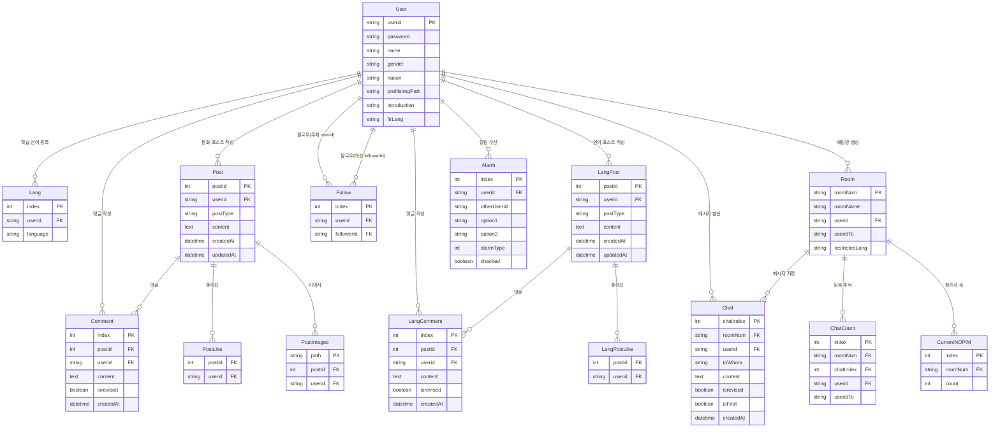
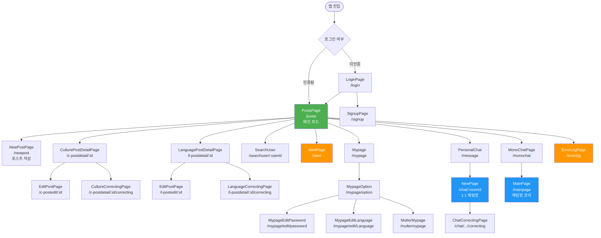
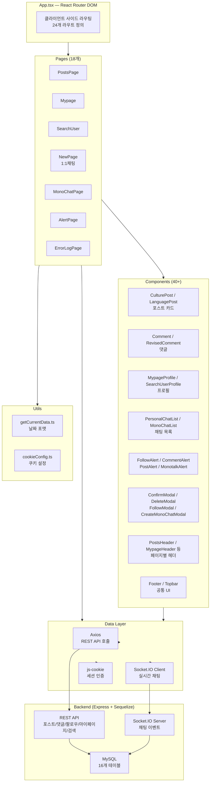
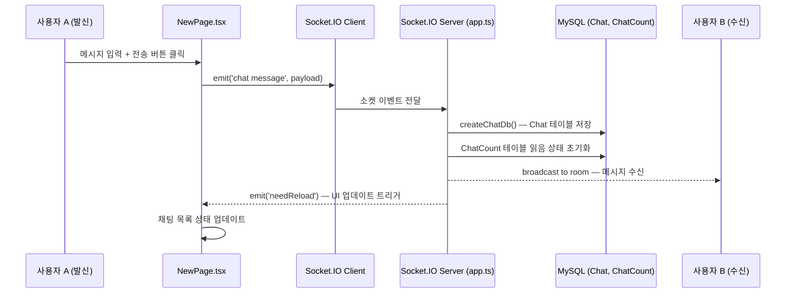
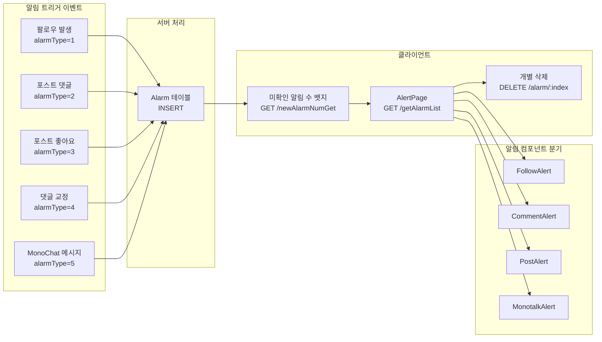

# NaiClover — 다이어그램 모음

> 이 파일은 `NAICLOVER_PORTFOLIO.md`에서 분리된 다이어그램 전용 파일입니다.

---

## 1. DB 구조도 (추정 ERD)

---

## 2. 화면 흐름도

---

## 3. 프론트엔드 아키텍처 다이어그램

---

## 4. 실시간 채팅 데이터 흐름

---

## 5. 알림 시스템 흐름

